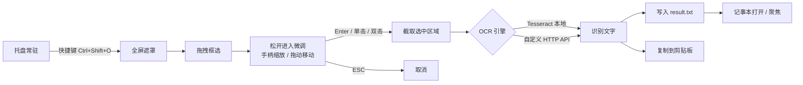

<div align="center">
  

  # QuickOcr

  **按下快捷键，框选屏幕上的文字，结果自动写进记事本。**

  Windows 屏幕 OCR 工具 · 托盘常驻 · 本地识别 · 免费开源

  
  
  [](https://github.com/mylxnet/QuickOcr/releases/latest)
  [](#许可)
  [](https://github.com/mylxnet/QuickOcr/stargazers)

  [下载安装](#下载安装) · [使用](#使用) · [设置](#设置) · [自定义 API](#自定义-http-api-约定) · [开发](#开发) · [常见问题](#常见问题)
</div>

---

## 简介

QuickOcr 是一个常驻系统托盘的 Windows 屏幕文字识别（OCR）小工具。它解决一个很具体的场景：**你只想把屏幕上某段文字抠出来，而不是先截图、再打开某个软件、再粘贴、再点识别。**

默认按 `Ctrl+Shift+O`，屏幕变暗进入框选模式，拖出想要的区域后还能用鼠标微调位置和大小，确认后一秒出结果——**自动用系统记事本打开**，同时复制到剪贴板。

识别默认走本地 Tesseract 引擎，离线可用、完全免费；也支持切换到你自己的 HTTP OCR 接口。

## 工作流程



## 功能特性

**框选交互**

- 全局快捷键触发，可在设置中重新录入
- 全屏半透明遮罩，选区内部透明高亮、外部暗化，所见即所得
- 拖拽框选后进入微调模式：8 个手柄缩放、选区内部拖动移动、选区外部重新框选
- 实时显示选区像素尺寸，超出屏幕自动让位
- `Enter` / 选区内单击 / 双击 三种方式确认，`ESC` 随时取消
- 跨多显示器框选，PerMonitorV2 DPI 感知，坐标不失真

**识别引擎**

- Tesseract 5 本地引擎，中英文混合识别（`chi_sim+eng`）
- 语言包首次缺失时自动下载并缓存，之后完全离线
- 可选自定义 HTTP OCR API，引擎可插拔，切换即时生效

**输出与容错**

- 识别结果写入固定临时文件并用记事本打开，同一进程内复用记事本窗口，不堆叠
- 内容未变化时只聚焦窗口，不重复写文件
- 应用单实例：重复启动不会开第二个进程，而是唤醒已有实例
- 识别任务串行锁：上一次未结束时新触发直接丢弃，不会卡死界面
- 记事本被手动关闭后自动重启，无需干预
- 文件日志按天滚动，出问题可查

**其他**

- 多尺寸矢量图标（16~256 px），大图标模式下不失真
- 内置帮助手册与关于窗口
- 开机自启开关（写 `HKCU\...\Run`，无需管理员权限）

## 下载安装

前往 [Releases](https://github.com/mylxnet/QuickOcr/releases/latest) 下载：

| 文件 | 大小 | 说明 |
|---|---|---|
| `QuickOcr_Setup.exe` | 约 226 MB | 单文件自解压安装器。双击后解压到 `%LocalAppData%\QuickOcr\1.0.0\` 并自动启动，目标机**无需安装 .NET** |
| `publish.zip` | 约 72 MB | 免安装绿色版。解压到任意目录后直接运行 `QuickOcr.exe` |

### 系统要求

- Windows 10 / 11（x64）
- 无需安装 .NET 运行时（发行包已自带）
- 无需管理员权限

> 首次识别时若缺少语言包，会自动从 CDN 下载 `chi_sim` + `eng`（约 3~4 MB），需要联网；下载完成后即可离线使用。

## 使用

### 快捷键

| 操作 | 说明 |
|---|---|
| `Ctrl+Shift+O` | 触发框选识别（默认值，可在设置中更改） |
| 鼠标拖拽 | 框选识别区域 |
| 拖选区内部 | 微调阶段整体移动选区 |
| 拖四角 / 四边手柄 | 微调阶段调整选区大小 |
| 拖选区外部 | 放弃当前选区，重新框选 |
| `Enter` / 选区内单击 / 双击 | 确认执行识别 |
| `ESC` | 取消框选 |

### 一次典型使用

1. 屏幕上看到想要的文字，例如一段报错日志
2. 按 `Ctrl+Shift+O`，屏幕变暗
3. 拖拽框住这段文字，松开鼠标
4. 选区上出现手柄，拖动微调到刚好贴合文字
5. 按 `Enter`（或双击选区内），文字随即出现在记事本中，同时已复制到剪贴板

### 托盘菜单

右键任务栏的 QuickOcr 图标：

| 菜单项 | 作用 |
|---|---|
| 立即识别 | 等同于按一次快捷键 |
| 设置... | 打开设置窗口（双击托盘图标同效） |
| 帮助手册 | 打开内置使用说明，含当前实际绑定的快捷键 |
| 关于 | 版本号、技术栈与许可信息 |
| 退出 | 结束程序 |

## 设置

右键托盘图标 → 设置...。可配置项如下：

| 设置项 | 默认值 | 说明 |
|---|---|---|
| 快捷键 | `Ctrl + Shift + O` | 点击输入框后直接按下组合键即可录入，需至少包含一个 Ctrl / Shift / Alt / Win 修饰键 |
| 识别引擎 | Tesseract 本地引擎 | 可切换为「自定义 HTTP API」 |
| Tesseract 语言 | `chi_sim+eng` | 语言包组合，`+` 连接；如只需英文可填 `eng` |
| 自定义 API 地址 | 空 | 所选引擎为 HTTP API 时启用 |
| 鉴权头名称 / 值 | 空 | 可选，用于需要鉴权的自建接口 |
| 识别后复制到剪贴板 | 开 | |
| 识别后用记事本打开 | 开 | 关闭后仅复制到剪贴板 |
| 开机自启 | 关 | 写入当前用户注册表 `Run` 项 |

保存后快捷键立即重新注册；若该组合已被其他程序占用，会提示更换，不会静默失效。

## 自定义 HTTP API 约定

选择「自定义 HTTP API」引擎后，QuickOcr 会按以下约定调用你的接口：

| 项 | 约定 |
|---|---|
| 请求方法 | `POST` |
| 请求地址 | 设置中的「自定义 API 地址」 |
| 请求体 | `multipart/form-data` |
| 图片字段 | 字段名 `image`，文件名 `capture.png`，Content-Type `image/png` |
| 响应体 | JSON `{"text": "识别到的文字"}` |
| 超时 | 30 秒 |
| 可选鉴权 | 通过设置中的「鉴权头名称 / 值」附加自定义请求头，例如 `Authorization` + `Bearer xxx` |

若响应不是约定的 JSON 结构，QuickOcr 会退而把整个响应体当作文字输出，便于排查接口问题。

最小实现示例（Python + Flask）：

```python
from flask import Flask, request, jsonify
app = Flask(__name__)

@app.post("/ocr")
def ocr():
    image = request.files["image"]
    text = your_ocr_function(image.read())
    return jsonify(text=text)
```

## 数据与文件位置

| 内容 | 路径 |
|---|---|
| 配置文件 | `%AppData%\QuickOcr\settings.json` |
| 日志文件 | `%AppData%\QuickOcr\logs\QuickOcr_yyyyMMdd.log` |
| Tesseract 语言包 | `%AppData%\QuickOcr\tessdata\*.traineddata` |
| 识别结果临时文件 | `%Temp%\QuickOcr\result.txt` |
| 安装器解压目录 | `%LocalAppData%\QuickOcr\1.0.0\` |

配置、日志与语言包均可安全删除，程序会按需重新生成。

## 开发

### 环境要求

- [.NET 8 SDK](https://dotnet.microsoft.com/download/dotnet/8.0)
- Windows 10 / 11 x64

### 构建与运行

```powershell
cd src\QuickOcr
dotnet build -c Debug -p:Platform=x64
dotnet run
```

### 发布（绿色版）

```powershell
dotnet publish src\QuickOcr -c Release -r win-x64 --self-contained true -o publish
```

`publish` 文件夹即为可分发内容，自带 .NET 运行时。

### 一键生成安装包

```powershell
powershell -ExecutionPolicy Bypass -File build.ps1
```

脚本会依次发布主程序、压缩为 `publish.zip`、再构建自解压安装器，最终产出 `dist\QuickOcr_Setup.exe`。

> **为什么不是纯单文件 exe？**
> 主程序依赖的 Tesseract 封装（InteropDotNet）通过 `Assembly.Location` 定位本地库目录，在 `PublishSingleFile` 模式下该值为空，会导致原生库加载失败。因此主程序采用「exe + 依赖 dll + `x64\` 原生库目录」的结构；安装器本身则是真正的单文件 exe（内嵌 `publish.zip` 并在运行时解压）。

### 项目结构

```
QuickOcr/
├── build.ps1                       一键发布脚本
├── src/
│   ├── QuickOcr/                   主程序（.NET 8 + WPF）
│   │   ├── App.xaml(.cs)           启动入口、托盘与热键装配
│   │   ├── Tray/                   托盘图标与右键菜单
│   │   ├── SingleInstance/         Mutex + 命名管道单实例守卫
│   │   ├── Hotkey/                 全局热键注册、热键定义与序列化
│   │   ├── Capture/                全屏框选遮罩（拖拽 / 微调 / 多屏）
│   │   ├── Ocr/                    引擎接口、Tesseract、HTTP API、工厂、语言包管理
│   │   ├── Output/                 记事本复用输出
│   │   ├── Settings/               设置窗口、配置持久化、开机自启
│   │   ├── Help/                   帮助手册窗口
│   │   ├── About/                  关于窗口
│   │   ├── Utils/                  日志、Win32 互操作
│   │   └── Assets/                 应用图标与图标生成脚本
│   └── QuickOcr.Sfx/               自解压安装器（单文件 SFX）
└── README.md
```

## 技术栈

| 层面 | 选型 |
|---|---|
| 框架 | .NET 8 + WPF（`PerMonitorV2` DPI 感知） |
| OCR | Tesseract 5（[Patagames.Tesseract](https://www.nuget.org/packages/Tesseract)） |
| 截图 | System.Drawing `Graphics.CopyFromScreen` |
| 原生调用 | Win32 `RegisterHotKey` / `NotifyIcon` / `SetForegroundWindow` |
| 配置 | System.Text.Json |
| 打包 | `dotnet publish` self-contained + 自解压安装器 |

## 常见问题

**按了快捷键没反应？**
大概率是该组合已被其他程序占用。用日志确认：打开 `%AppData%\QuickOcr\logs\` 当天日志，若出现热键注册失败，说明被占用，请在设置里换一组组合键。此外，若程序未运行，托盘区也不会有图标，请先启动。

**第一次识别特别慢？**
首次触发时会下载 `chi_sim` 与 `eng` 语言包（约 3~4 MB）。下载完成后本地缓存，后续识别无需联网。

**提示「无法下载 Tesseract 语言包」？**
说明当前网络无法访问下载源。可手动下载 [tessdata_fast](https://github.com/tesseract-ocr/tessdata_fast) 中的 `chi_sim.traineddata` 与 `eng.traineddata`，放到 `%AppData%\QuickOcr\tessdata\` 目录即可。

**识别结果有错字或漏字？**
Tesseract 对低分辨率、艺术字、复杂背景的效果有限。建议：框选区域尽量只包含文字本身、贴近文字边缘；尽量选择清晰、字号较大的文字；若对精度要求高，可在设置中切换到自定义 HTTP API 引擎，接入更强的识别服务。

**记事本窗口没弹到最前面？**
输出采用记事本复用策略，第二次识别会聚焦已打开的窗口而不是新开。若被其他窗口遮挡，可从任务栏点一下；这是为了避免多次识别后堆叠出一排记事本窗口。

**重复启动会开两个程序吗？**
不会。第二次启动会通过命名管道唤醒已在运行的实例；此时不会再开新窗口。

**能识别屏幕以外的东西吗，比如本地图片文件？**
当前版本只支持屏幕区域框选，尚未提供文件导入入口。

## 许可

- 本项目代码：[MIT](https://opensource.org/licenses/MIT)
- Tesseract：Apache 2.0
- 语言包数据：[tesseract-ocr/tessdata_fast](https://github.com/tesseract-ocr/tessdata_fast)

## 作者

© 2026 QuickOcr · by Mr Lin
